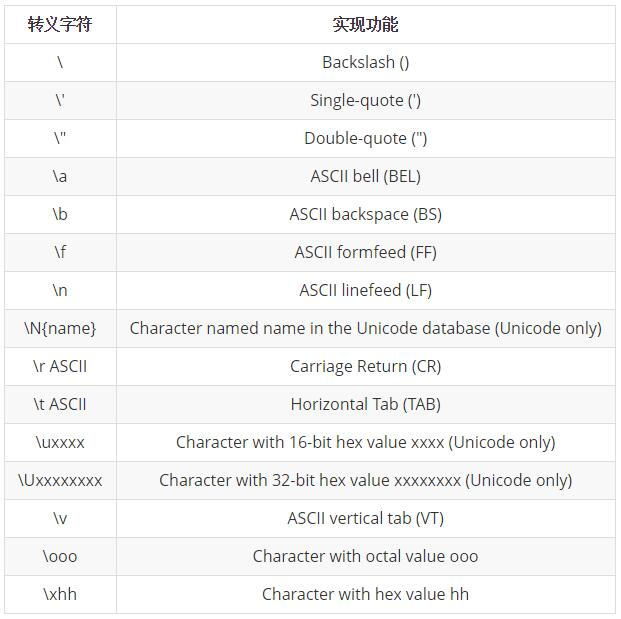

# exercise10.那是什么?
在习题 9 中我们接触了一些新东西。我让你看到两种让字符串扩展到多行的方法。第一种方法是在月份之间用 \n (back-slash n )隔开。 这两个字符的作用是在该位置上放入一个“新行(new line)”字符。

使用反斜杠 \(back-slash) 可以将难打印出来的字符放到字符串。针对不同的符号有很多这样的所谓“转义序列(escape sequences)”，但有一个特殊的转义序列，就是 双反斜杠(double back-slash) \\ 。这两个字符组合会打印出一个反斜杠来。接下来我们做几个练习，然后你就知道这些转义序列的意义了。

另外一种重要的转义序列是用来将单引号 ' 和双引号 " 转义。想象你有一个用双引号引用起来的字符串，你想要在字符串的内容里再添加一组双引号进去，比如你想说 "I "understand" joe."，Python 就会认为 "understand" 前后的两个引号是字符串的边界，从而把字符串弄错。你需要一种方法告诉 python 字符串里边的双引号是字符串而不是真正的双引号。

要解决这个问题，你需要将双引号和单引号转义，让 Python 将引号也包含到字符串里边去。这里有一个例子：

```
"I am 6'2\" tall."  # 将字符串中的双引号转义
'I am 6\'2" tall.'  # 将字符串中的单引号转义
```

第二种方法是使用“三引号(triple-quotes)”，也就是 """，你可以在一组三引号之间放入任意多行的文字。接下来你将看到用法。

```
tabby_cat = "\tI'm tabbed in."
persian_cat = "I'm split\non a line."
backslash_cat = "I'm \\ a \\ cat."

fat_cat = """
I'll do a list:
\t* Cat food
\t* Fishies
\t* Catnip\n\t* Grass
"""

print tabby_cat
print persian_cat
print backslash_cat
print fat_cat
```

## 你看到的结果

注意你打印出来的制表符，这节练习中的文字间隔对于答案的正确性是很重要的。

```
$ python ex10.py
        I'm tabbed in.
I'm split
on a line.
I'm \ a \ cat.

I'll do a list:
        * Cat food
        * Fishies
        * Catnip
        * Grass
```

## 转义序列



这里有一小段有意思的代码，尝试说明它们实现了什么功能：

```
while True:
    for i in ["/","-","|","\\","|"]:
        print "%s\r" % i,
```

## 附加题

> 1.通过把它们写在卡片上记住所有的转义序列。
2.使用'''(三个单引号)取代三个双引号，看看效果是不是一样的？
3.结合转义序列和格式字符串创建一个更复杂的格式。
4.记得 %r 格式化字符串吗？使用 %r 搭配单引号和双引号转义字符打印一些字符串出来。 将 %r 和 %s 比较一下。 注意到了吗？%r 打印出来的是你写在脚本里的内容，而 %s 打印的是你应该看到的内容。

## 常见问题

### Q:如果我想把所有的月份写在新的一行上，应该怎么做?

> 像这样写就可以: "\nJan\nFeb\nMar\nApr\nMay\nJun\nJul\nAug"

### Q: 我还没有完全弄明白最后一句代码，我应该继续研究吗？

> 当然要继续。把每次练习题中你不明白的地方记下来。当你完成更多的练习的时候，定期检查你的笔记，看看你是否可以明白笔记中的内容。有时候你可能需要回去看看之前做过的练习，并且重复的完成它们。

### Q: 是什么让\\不同于其他的转义字符?

> 这是一种简单的写出 (\)字符的方法. 自己想想为什么我们需要\\

### Q:为什么我写//或者/n 的时候，代码没有生效。

> 因为你用的是/ 而不是\.这两个是不同的字符串，他们的作用也是不一样的。

### Q:当我使用%r 格式的时候，转义字符都没有生效。

> 因为%r 打印出来的是你写在脚本里的内容, 这当然也会包含原始的转移序列的字符。可以使用%s。一定要记住：%r 是调试用的，而%s 才是显示输出用的。

### Q:我没有明白附加题 3.你所说的“结合”转义序列和格式是什么意思？

> 你需要明白一点，所有的这些练习题，都可以结合起来解决一些难题。这节练习带你了解了格式化字符串，你可以结合使用格式化字符串和转义字符写一些新的代码。

### Q: ''' 和"""哪个更好?

> 这个只依赖于你的代码风格。 现在可以使用''' (三个单引号)，但是也要做好准备别人都在用的，感觉更好的方式。