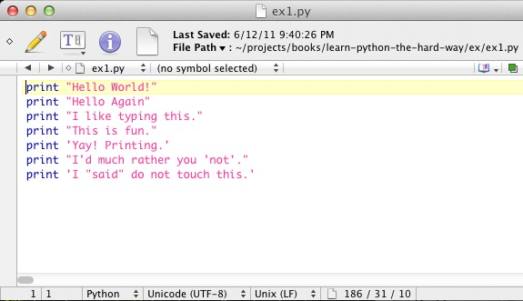
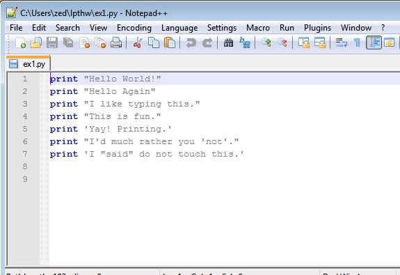
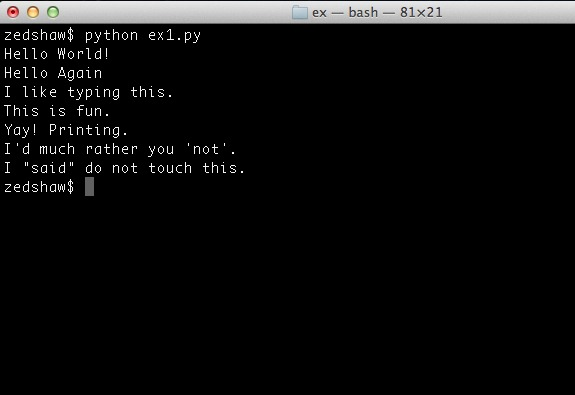
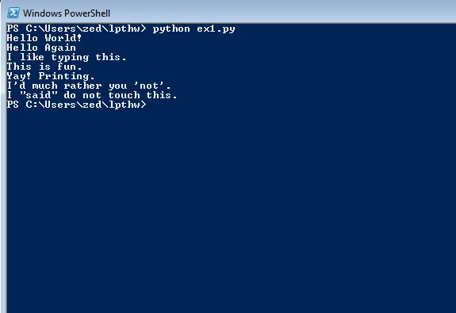

# exercise1.第一个程序
> **Warning:** 如果你没有做练习 0，说明你没有用正确的办法使用本书。你需要仔细阅读我书中提到的每一点。比如，你有没有打算用 Python3 来完成书中的习题？我在练习 0 中说过不要使用 Python3；你是不是打算使用什么 IDE 来编辑代码？我同样说过你现在不需要这些，你只需要一个文本编辑器就够了。如果你没有阅读练习 0 的内容，请回过头重新阅读一下。

你应该在练习 0 中花了不少的时间，学会了如何安装文本编辑器、运行文本编辑器、以及如何运行命令行终端，而且你已经花时间熟悉了这些工具。请不要跳过前一个练习的内容直接进行下面的内容，这也是本书唯一的一次这样的警示。

将下面的内容写到一个文件中，取名为 ex1.py。注意这个命名方式，Python 文件最好以.py 结尾。

```
print "Hello World!"
print "Hello Again"
print "I like typing this."
print "This is fun."
print 'Yay! Printing.'
print "I'd much rather you 'not'."
print 'I "said" do not touch this.'
```

如果你使用的是 Mac OSX 系统，你看到的应该是下面的样子： mac osx ex1



如果你在 windows 上使用的 Notepad++编辑器，你看到的应该是下图的样子： 



如果你的编辑器跟这些图都不太一样，也没关系，是比较相似的就是正确的。当你创建文件的时候，注意以下几点：

> 1.不需要输入上面内容最左侧的行号，他们的作用是我可以在跟大家讨论某一行代码的时候，可以跟大家说，“请看第几行”。你不需要把行号输入到 Python 的脚本中。 2.我在 ex1.py 的每一行开始都用到了 print，他们看起来是一模一样的。每一个字符在脚本中都有它自己的角色，颜色并不重要，重要的是你输入的是正确的。

然后在命令行终端通过输入以下内容来运行这段代码： python ex1.py

如果你输入正确的话，你应该看到和下面图片一样的内容。如果不一样，那就是你写错了什么。不是计算机出错了，计算机没错。

## 你应该看到的输出

在 Mac OSX 的终端中，你会看到：



在 windows 的终端中，你会看到： 



在 python ex1.py 命令之前，你可能会看到不同的计算机或目录名字，这不是问题，重点是你输入这个命令后，能看到和我的输出一样的结果。

如果你遇到了类似下面的错误：

```
$ python ex/ex1.py
  File "ex/ex1.py", line 3
    print "I like typing this.
                             ^
SyntaxError: EOL while scanning string literal
```

你能看懂这些错误信息是很重要的，因为之后你可能会犯更多的错误。即使是我，也犯过很多的错误。下面让我们逐行的分析报错信息:

> 1.首先我们在命令行终端输入命令来运行 ex1.py 脚本。 2.Python 告诉我们 ex1.py 文件的第 3 行有一个错误。 3.然后这一行的内容被打印了出来。 4.然后 Python 打印出一个^(井号，caret) 符号，用来指示出错的位置。 注意到少了一个"(双引号，double-quote) 符号了吗？ 5.最后，它打印出了一个“语法错误(SyntaxError)”告诉你究竟是什么样的错误。通常这些错误信息都比较难懂，不过你可以把错误信息复制到搜索引擎里，然后你就能看到别人也遇到过这样的错误，也许你还能在网上找到如何解决这个问题。

> **Warning:** 如果你来自另外一个国家，而且你看到关于 ASCII 编码的错误，那就在你的 python 脚本的最上面加入这一行:# -*- coding: utf-8 -*- 这样你就在脚本中使用了 unicode UTF-8 编码，这些错误就不会出现了。

## 附加题

你还有 **附加题** 需要完成。加分习题里边的内容是供你尝试的。如果你觉得做不出来，你可以暂时跳过，过段时间再回来做。

> 1.让你的脚本多打印一行； 2.让你的脚本只打印一行； 3.在某行的起始位置放一个#(#)符号。它的作用是什么？自己研究一下。

从现在开始，如果我们没有遇到与这个习题不同的练习，我不会再逐个解释这些习题是怎么运行的。

> **NOTE:** #号有很多的英文名字，例如：octothorpe(八角帽)，pound(英镑符), hash(电话的#键), mesh(网)等。

## 常见问题

下面是一些学生在做习题的时候提出的一些真实问题。

### Q:我可以使用 IDE 吗？

> 不可以，你应该像我一样使用终端，如果你不知道怎么使用终端的话，你可以阅读附录 A 中的命令行速成教程。

### Q:如何在我的编辑器里显示不同颜色？

> 先把你的文件保存为.py 结尾的文件，比如 ex1.py，之后你再编辑的时候，就会有颜色区别了。

### Q:我执行脚本的时候，遇到一个 SyntaxError: invalid syntax 报错

> 你可能想运行 Python，可是你多打了一次 Python,重启你的终端程序，并用正确的方法输入命令 python ex1.py.

### Q:我遇到报错 can't open file 'ex1.py': [Errno 2] No such file or directory

> 你应该进入你文件保存的目录下。确保你执行了 cd 命令已进入文件目录。比如，你的文件保存在目录 lpthw/ex1.py 下，那你应当在执行 python ex1.py 之前先执行 cd lpthw/。如果不明白我说的什么意思，请先通读附录 A。

### Q:在我的文件中，如何显示我自己国家的文字？

> 在你文件的第一行输入# -*- coding: utf-8 -*-。

### Q:我的文件没有运行；我的文件运行后没有输出

> 请逐字逐句的检查你的代码文件，你应该输入 print "Hello World!"而不只 是"Hello World!"，检查你的文件，是不是没有 print，请保证你的文件和我的一模一样。