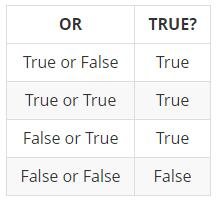
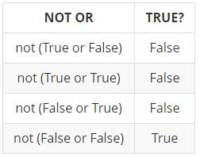
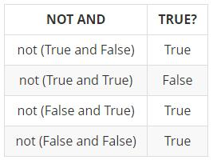
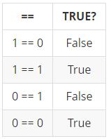

# exercise27. 记住逻辑
到此为止你已经学会了读写文件，命令行处理，以及很多 Python 数学运算功能。今天，你将要开始学习逻辑了。

你要学习的不是研究院里的高深逻辑理论，只是程序员每天都用到的让程序跑起来的基础逻辑知识。

学习逻辑之前你需要先记住一些东西。这个练习我要求你坚持一个星期，就算你烦得不得了，也要坚持下去。这个练习会让你背下来一系列的逻辑表格，这会让你更容易地完成后面的习题。

需要事先警告你的是：这件事情一开始一点乐趣都没有，一开始你会觉得它很无聊乏味，但它的目的是教会你一个程序员必备的重要技能。你必须记住一些重要的概念，一旦你明白了这些概念，你会相当有成就感，虽然一开始你会觉得它们很难掌握，就跟和乌贼摔跤一样，而等到某一天，你会刷的一下豁然开朗。你会从这些基础的记忆学习中得到丰厚的回报。

这里告诉你一个记住某样东西，而不让自己抓狂的小技巧：在一整天里，每次记忆一小部分，把你最需要加强的部分标记起来。不要想着在两小时内连续不停地背诵，这不会有什么好的效果。不管你花多长时间，你的大脑也只会留住你在前 15 或者 30 分钟内看过的东西。另外，你需要制作一些索引卡片，卡片正面写下逻辑关系，反面写下答案。你的目标是：拿出一张卡片来，看到正面的表达式，例如 “True or False”，你可以立即说出背面的结果是 “True”！坚持练习，直到你能做到这一点为止。

一旦你能做到这一点了，接下来你需要每天晚上写一份真值表出来。不要只是抄写，试着默写，如果发现哪里没记住的话，就飞快地撇一眼这里的答案。这样做可以训练你的大脑记住整个真值表。

不要在这上面花超过一周的时间，因为你在后面的应用过程中还会继续学习它们。

## 逻辑术语

在 python 中我们会用到下面的术语（字符或者词汇）来定义事物的真(True)或者假(False)。计算机的逻辑就是在程序的某个位置检查这些字符或者变量组合在一起表达的结果是真是假。

> - and 与
- or 或
- not 非
- != (not equal) 不等于
- == (equal) 等于
- `>=` (greater-than-equal) 大于等于
- <= (less-than-equal) 小于等于
- True 真
- False 假

其实你已经见过这些字符了，但这些词汇你可能还没见过。这些词汇(and, or, not)和你期望的效果其实是一样的，跟英语里的意思一模一样。

## 真值表

我们将使用下面这些字符来创建你需要记住的真值表：

现在使用这些表格创建你自己的卡片，再花一个星期慢慢记住它们。记住一点：这本书中没有失败，只要每天尽力去学，在尽力的基础上再多花一点功夫就可以了。

## 常见问题

### Q:我不能只是学习布尔值的概念，而不记忆吗？

> 你当然可以这么做，但是当你编码的时候，你就需要不停的查找检索布尔值的规则。如果你先记住他们，这不仅仅是锻炼你的记忆能力，也使得这些操作更加自然。在此之后，布尔值的概念对你来说就会很简单。