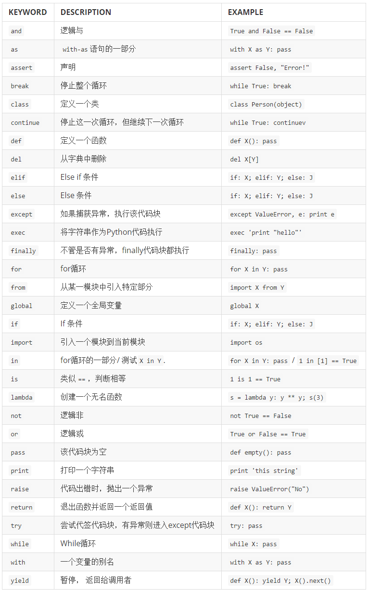
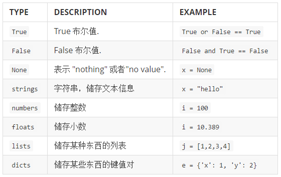
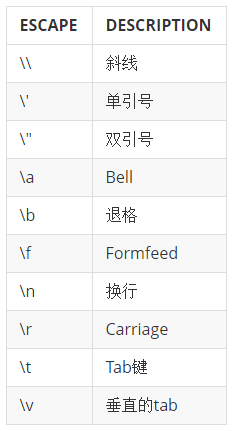
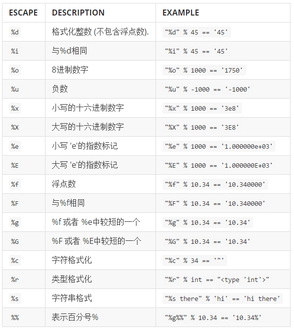
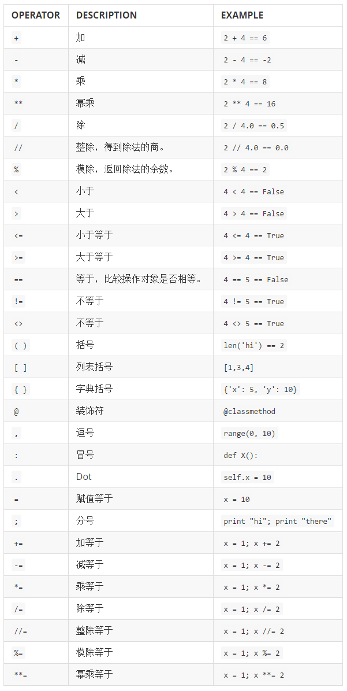

# exercise37.复习符号
现在该复习你学过的符号和 python 关键字了，而且你在本节还会学到一些新的东西。我在这里所作的是将所有的 Python 符号和关键字列出来，这些都是值得掌握的重点。

在这节课中，你需要复习每一个关键字，回想它的作用并且写下来，接着上网搜索它真正的功能。有些内容可能是难以搜索的，所以这对你可能有些难度，不过无论如何，你都要尝试一下。

如果你发现记忆中的内容有误，就在索引卡片上写下正确的定义，试着将自己的记忆纠正过来。

最后，将每一种符号和关键字用在程序里，你可以用一个小程序来做，也可以尽量多写一些程序来巩固记忆。这里的关键点是明白各个符号的作用，确认自己没搞错，如果搞错了就纠正过来，然后将其用在程序里，并且通过这样的方式加深自己的记忆。

## 关键字

## 数据类型

针对每一种数据类型，都举出一些例子来，例如针对 string，你可以举出一些字符串，针对 number，你可以举出一些数字。

## 字符串转义序列

对于字符串转义序列，你需要在字符串中应用它们，确认自己清楚地知道它们的功能。

## 字符串格式化

## 操作符

有些操作符号你可能还不熟悉，不过还是一一看过去，研究一下它们的功能，如果你研究不出来也没关系，记录下来日后解决。

花一个星期学习这些东西，如果你能提前完成就更好了。我们的目的是覆盖到所有的符号 类型，确认你已经牢牢记住它们。另外很重要的一点是这样你可以找出自己还不知道哪些 东西，为自己日后学习找到一些方向。

## 读代码

找一些 python 的代码读读试试。你可以读任何的 python 代码，并且可以借鉴其中的一些思想。你已经具备足够的知识去阅读代码，但是你可能还不能完全明白代码实现了什么功能。这节练习就是教给你如何用你学过的知识弄明白别人的代码。

首先，把你找到的代码打印出来，是的，你需要把它们打印出来，因为相比电脑屏幕，你的大脑和眼睛更容易看清楚纸上的内容。

接下来，通读你打印的代码，按照下面说的做一些笔记：

> 1.找出所有的函数，以及它们的功能。
2.每一个变量在哪里被赋予初始值。
3.代码的不同地方有没有相同名字的变量，这可能会带来隐患。
4.有没有 if 语句没有 else 代码块的，这么写对吗？
5.有没有无终止的 while 循环
6.标记出不管任何原因，你看不懂的代码部分。

第三步，当你做完上面内容之后，尝试给自己解释一下自己写的注释。说明这些函数是如何应用的，包含哪些变量，以及你想弄明白的其他事情。

最后，在所有难以理解的部分，逐行、逐个函数的跟踪每个变量的值。你也可以在准备一份打印的代码，在空白处写下你要跟踪的每个变量的值。

当你弄明白这段代码是做什么的之后，回到电脑上再读一遍代码，看看能不能找到一些新的东西。多找一些代码练习，直到你能不需要打印代码就能弄懂它们的功能为止。

## 附加题

> 1.弄明白“流程图”是什么，试着画几个出来
2.读代码的过程，如果发现了什么错误，尝试着改正它，并将你修改后的结果发给代码的作者。
3.另一个技巧是用#给你正在读的代码加注释，有时候，你的这些注释会帮到后面来读代码的人哦。

## 常见问题

### Q: %d 和%i 有什么区别？

> 没有区别，只不过由于历史原因，人们更喜欢用%d。

### Q: 我们怎么在网上搜索这些符号和关键字？

> 只要把“python”放在你要搜索的内容之前就可以了，比如，你想搜索 yield，那么就输入 python yield。