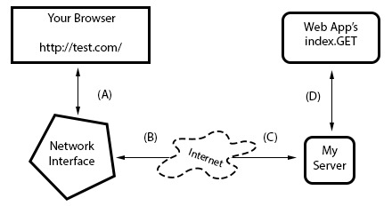

# exercise51.从浏览器获取输入
虽然能让浏览器显示“Hello World”是很有趣的一件事情，但是如果能让用户通过表单(form)向你的应用程序提交文本就更有趣了。这节习题中，我们将使用 form 改进你的 web 程序，并且将用户相关的信息保存到他们的“会话(session)”中。

## Web 的工作原理

该学点无趣的东西了。在创建 form 前你需要先多学一点关于 web 的工作原理。这里讲的并不完整，但是相当准确，在你的程序出错时，它会帮你找到出错的原因。另外，如果你理解了 form 的应用，那么创建 form 对你来说就会更容易了。

我将以一个简单的图示讲起，它向你展示了 web 请求的各个不同的部分，以及信息传递的大致流程：



为了方便讲述 HTTP 请求(request) 的流程，我在每条线上面加了字母标签以作区别：

> 1.你在浏览器中输入网址 http://test.com//，然后浏览器会通过你的电脑的网络设备发出 request（线路 A）。
2.你的 request 被传送到互联网（线路 B），然后再抵达远端服务器（线路 C），然后我的服务器将接受这个 request。
3.我的服务器接受 request 后，我的 web 应用程序就去处理这个请求（线路 D），然后我的 Python 代码就会去运行 index.GET 这个“处理程序(handler)”。
4.在代码 return 的时候，我的 Python 服务器就会发出响应(response)，这个响应会再通过线路 D 传递到你的浏览器。
5.这个网站所在的服务器将响应由线路 D 获取，然后通过线路 C 传至互联网。
6.响应通过互联网由线路 B 传至你的计算机，计算机的网卡再通过线路 A 将响应传给你的浏览器。
7.最后，你的浏览器显示了这个响应的内容。

这段解释中用到了一些术语。你需要掌握这些术语，以便在谈论你的 web 应用时你能明白而且应用它们：

浏览器(browser) 这是你几乎每天都会用到的软件。大部分人不知道它真正的原理，他们只会把它叫作“the internet”。它的作用其实是接收你输入到地址栏网址(例如 http://test.com/)，然后使用该信息向该网址对应的服务器提出请求(request)。

地址(address) 通常这是一个像 http://test.com/一样的 URL (Uniform Resource Locator，统一资源定位器)，它告诉浏览器该打开哪个网站。前面的 http 指出了你要使用的协议(protocol)，这里我们用的是“超文本传输协议(Hyper-Text Transport Protocol)”。你还可以试试 ftp://ibiblio.org/ ，这是一个“FTP 文件传输协议(File Transport Protocol)”的例子。test.com 这部分是“主机名(hostname)”，也就是一个便于人阅读和记忆的字串，主机名会被匹配到一串叫作“IP 地址”的数字上面，这个“IP 地址”就相当于网络中一台计算机的电话号码，通过这个号码可以访问到这台计算机。最后，URL 中还可以尾随一个“路径”，例如 http://test.com//book/中的/book/，它对应的是服务器上的某个文件或者某些资源，通过访问这样的网址，你可以向服务器发出请求，然后获得这些资源。网站地址还有很多别的组成部分，不过这些是最主要的。

连接(connection) 一旦浏览器知道了协议(http)、服务器(http://test.com/)、以及要获得的资源，它就要去创建一个连接。这个过程中，浏览器让操作系统(Operating System, OS)打开计算机的一个“端口(port)”（通常是 80 端口），端口准备好以后，操作系统会回传给你的程序一个类似文件的东西，它所做的事情就是通过网络传输和接收数据，让你的计算机和 http://test.com/这个网站所属的服务器之间实现数据交流。 当你使用 http://localhost:8080/访问你自己的站点时，发生的事情其实是一样的，只不过这次你告诉了浏览器要访问的是你自己的计算机(localhost)，要使用的端口 不是默认的 80，而是 8080。你还可以直接访问 http://test.com:80/， 这和不输入端口效果一样，因为 HTTP 的默认端口本来就是 80。

请求(request) 你的浏览器通过你提供的地址建立了连接，现在它需要从远端服务器要到它（或你）想要的资源。如果你在 URL 的结尾加了 /book/，那你想要的就是 /book/ 对应的文件或资源，大部分的服务器会直接为你调用 /book/index.html 这个文件，不过我们就假装不存在好了。浏览器为了获得服务器上的资源，它需要向服务器发送一个“请求”。这里我就不讲细节了，为了得到服务器上的内容，你必须先向服务器发送一个请求才行。有意思的是，“资源”不一定非要是文件。例如当浏览器向你的应用程序提出请求的时候，服务器返回的其实是你的 Python 代码生成的一些东西。

服务器(server) 服务器指的是浏览器另一端连接的计算机，它知道如何回应浏览器请求的文件和资源。大部分的 web 服务器只要发送文件就可以了，这也是服务器流量的主要部分。不过你学的是使用 Python 组建一个服务器，这个服务器知道如何接受请求，然后返回用 Python 处理过的字符串。当你使用这种处理方式时，你其实是假装把文件发给了浏览器，其实你用的都只是代码而已。就像你在《习题 50》中看到的，要构建一个“响应”其实也不需要多少代码。

响应(response) 这就是你的服务器回复你的请求，发回至浏览器的 HTML，它里边可能有 css、javascript、或者图像等内容。以文件响应为例，服务器只要从磁盘读取文件，发送给浏览器就可以了，不过它还要将这些内容包在一个特别定义的“头部信息(header)”中，这样浏览器就会知道它获取的是什么类型的内容。以你的 web 应用程序为例，你发送的其实还是一样的东西，包括 header 也一样，只不过这些数据是你用 Python 代码即时生成的。

这个可能是你能在网上找到的关于浏览器如何访问网站的最快的快速课程了。这节课程应该可以帮你更容易地理解本节的习题，如果你还是不明白，就到处找资料多多了解这方面的信息，直到你明白为止。有一个很好的方法，就是你对照着上面的图示，将你在《习题 50》中创建的 web 程序中的内容分成几个部分，让其中的各部分对应到上面的图示。如果你可以正确地将程序的各部分对应到这个图示，你就大致明白它的工作原理了。

## 表单(form) 的工作原理

熟悉“表单”最好的方法就是写一个可以接收表单数据的程序出来，然后看你可以对它做些什么。先将你的 bin/app.py 修改成下面的样子：

```
import web

urls = (
  '/hello', 'Index'
)


app = web.application(urls, globals())

render = web.template.render('templates/')

class Index(object):
    def GET(self):
        form = web.input(name="Nobody")
        greeting = "Hello, %s" % form.name

        return render.index(greeting = greeting)

if __name__ == "__main__":
    app.run()
```

重启你的 web 程序（按 CTRL-C 后重新运行），确认它有运行起来，然后使用浏览器访问 http://localhost:8080/hello，这时浏览器应该会显示“I just wanted to say Hello, Nobody.”，接下来，将浏览器的地址改成 http://localhost:8080/hello?name=Frank，然后你可以看到页面显示为“Hello, Frank.”，最后将 name=Frank 修改为你自己的名字，你就可以看到它对你说“Hello”了。

让我们研究一下你的程序里做过的修改:

> 1.我们没有直接为 greeting 赋值，而是使用了 web.input 从浏览器获取数据。这个函数会将一组 key=value 的表述作为默认参数，解析你提供的 URL 中的?name=Frank 部分，然后返回一个对象，你可以通过这个对象方便地访问到表单的值。
2.然后我通过 form 对象的 form.name 属性为 greeting 赋值，这句你应该已经熟悉了。
3.其他的内容和以前是一样的。

URL 中该还可以包含多个参数。将本例的 URL 改成这样子： http://localhost:8080/hello?name=Frank&greet=Hola。然后修改代码，让它去获取 form.name 和 form.greet，如下所示：

```
greeting = "%s, %s" % (form.greet, form.name)
```

修改完毕后，试着访问新的 URL。然后将 &greet=Hola 部分删除，看看你会得到什么样的错误信息。由于我们在 web.input(name="Nobody") 中没有为 greet 设定默认值，这样 greet 就变成了一个必须的参数，如果没有这个参数程序就会报错。现在修改一下你的程序，在 web.input 中为 greet 设一个默认值试试看。另外你还可以设 greet=None，这样你可以通过程序检查 greet 的值是否存在，然后提供一个比较好的错误信息出来，例如：

```
form = web.input(name="Nobody", greet=None)

if form.greet:
    greeting = "%s, %s" % (form.greet, form.name)
    return render.index(greeting = greeting)
else:
    return "ERROR: greet is required."
```

## 创建 HTML 表单

你可以通过 URL 参数实现表单提交，不过这样看上去有些丑陋，而且不方便一般人使用，你真正需要的是一个“POST 表单”，这是一种包含了<form> 标签的特殊 HTML 文件。这种表单收集用户输入并将其传递给你的 web 程序，这和你上面实现的目的基本是一样的。

让我们来快速创建一个，从中你可以看出它的工作原理。你需要创建一个新的 HTML 文件， 叫做 templates/hello_form.html：

```
<html>
    <head>
        <title>Sample Web Form</title>
    </head>
<body>

<h1>Fill Out This Form</h1>

<form action="/hello" method="POST">
    A Greeting: <input type="text" name="greet">
    <br/>
    Your Name: <input type="text" name="name">
    <br/>
    <input type="submit">
</form>

</body>
</html>
```

然后修改 bin/app.py:

```
import web

urls = (
  '/hello', 'Index'
)

app = web.application(urls, globals())

render = web.template.render('templates/')

class Index(object):
    def GET(self):
        return render.hello_form()

    def POST(self):
        form = web.input(name="Nobody", greet="Hello")
        greeting = "%s, %s" % (form.greet, form.name)
        return render.index(greeting = greeting)

if __name__ == "__main__":
    app.run()
```

都写好以后，重启 web 程序，然后通过你的浏览器访问它。

这回你会看到一个表单，它要求你输入“一个问候语句(A Greeting)”和“你的名字(Your Name)”，等你输入完后点击“提交(Submit)”按钮，它就会输出一个正常的问候页面，不过这一次你的 URL 还是 http://localhost:8080/hello，并没有添加参数进去。

在 hello_form.html 里面关键的一行是 <form action="/hello" method="POST">，它告诉你的浏览器以下内容：

> 1.从表单中的各个栏位收集用户输入的数据。
2.让浏览器使用一种 POST 类型的请求，将这些数据发送给服务器。这是另外一种浏览器请求，它会将表单栏位“隐藏”起来。
3.将这个请求发送至/helloURL(这是由 action="/hello"告诉浏览器的)。

你可以看到两段<input> 标签的名字属性(name)和代码中的变量是对应的，另外我们在 class index 中使用的不再只是 GET 方法，而是另一个 POST 方法。

这个新程序的工作原理如下：

> 1.浏览器访问到 web 程序的 /hello 目录，它发送了一个 GET 请求，于是我们的 index.GET 函数就运行并返回了 hello_form。
2.你填好了浏览器的表单，然后浏览器依照<form>中的要求，将数据通过 POST 请求的方式发给 web 程序。
3.Web 程序运行了 index.POST 方法（不是 index.GET 方法）来处理这个请求。
4.这个 index.POST 方法完成了它正常的功能，将 hello 页面返回，这里并没有新的东西，只是一个新函数名称而已。

作为练习，在 templates/index.html 中添加一个链接，让它指向 /hello，这样你可以反复填写并提交表单查看结果。确认你可以解释清楚这个链接的工作原理，以及它是如何让你实现在 templates/index.html 和 templates/hello_form.html 之间循环跳转的，还有就是要明白你新修改过的 Python 代码，你需要知道在什么情况下会运行到哪一部分代码。

## 创建布局模板(layout template)

在你下一节练习创建游戏的过程中，你需要创建很多的小 HTML 页面。如果你每次都写一个完整的网页，你会很快感觉到厌烦的。幸运的 是你可以创建一个“布局模板”，也就是一种提供了通用的头文件和脚注的外壳模板，你可以用它将你所有的其他网页包裹起来。好程序员会尽可能减少重复动作，所以要做一个好程序员，使用布局模板是很重要的。

将 templates/index.html 修改成这样：

```
$def with (greeting)

$if greeting:
    I just wanted to say <em style="color: green; font-size: 2em;">$greeting</em>.
$else:
    <em>Hello</em>, world!
```

然后修改 templates/hello_form.html:

```
<h1>Fill Out This Form</h1>

<form action="/hello" method="POST">
    A Greeting: <input type="text" name="greet">
    <br/>
    Your Name: <input type="text" name="name">
    <br/>
    <input type="submit">
</form>
```

上面这些修改的目的，是将每一个页面顶部和底部的反复用到的“boilerplate”代码剥掉。这些被剥掉的代码会被放到一个单独的 templates/layout.html 文件中，从此以后，这些反复用到的代码就由 layout.html 来提供了。

上面的都改好以后，创建一个 templates/layout.html 文件，内容如下：

```
$def with (content)

<html>
<head>
    <title>Gothons From Planet Percal #25</title>
</head>
<body>

$:content

</body>
</html>
```

这个文件和普通的模板文件类似，不过其它的模板的内容将被传递给它，然后它会将其它 模板的内容“包裹”起来。任何写在这里的内容多无需写在别的模板中了。你需要注意$:content 的用法，这和其它的模板变量有些不同。

最后一步，就是将 render 对象改成这样： render = web.template.render('templates/', base="layout")

这会告诉 lpthw.web 让它去使用 templates/layout.html 作为其它模板的基础模板。重启你的程序观察一下，然后试着用各种方法修改你的 layout 模板，不要修改你别的模板，看看输出会有什么样的变化。

## 为表单撰写自动测试代码

使用浏览器测试 web 程序是很容易的，只要点刷新按钮就可以了。不过毕竟我们是程序员嘛，如果我们可以写一些代码来测试我们的程序，为什么还要重复手动测试呢？接下来你要做的，就是为你的 web 程序写一个小测试。这会用到你在《习题 47》学过的一些东西，如果你不记得的话，可以复习一下。

为了让 Python 加载 bin/app.py 并进行测试，你需要先做一点准备工作。首先创建一个 bin/__init__.py 空文件，这样 Python 就会将 bin/ 当作一个目录了。（在《习题 52》中你会去修改 __init__.py，不过这是后话。）

我还为 lpthw.web 创建了一个简单的小函数，让你判断(assert) web 程序的响应，这个函数的名字，叫 assert_response。创建一个 tests/tools.py 文件，内容如下：

```
from nose.tools import *
import re

def assert_response(resp, contains=None, matches=None, headers=None, status="200"):

    assert status in resp.status, "Expected response %r not in %r" % (status, resp.status)

    if status == "200":
        assert resp.data, "Response data is empty."

    if contains:
        assert contains in resp.data, "Response does not contain %r" % contains

    if matches:
        reg = re.compile(matches)
        assert reg.matches(resp.data), "Response does not match %r" % matches

    if headers:
        assert_equal(resp.headers, headers)
```

准备好这个文件以后，你就可以为你的 bin/app.py 写自动测试代码了。创建一个新文件，叫做 tests/app_tests.py，内容如下：

```
from nose.tools import *
from bin.app import app
from tests.tools import assert_response

def test_index():
    # check that we get a 404 on the / URL
    resp = app.request("/")
    assert_response(resp, status="404")

    # test our first GET request to /hello
    resp = app.request("/hello")
    assert_response(resp)

    # make sure default values work for the form
    resp = app.request("/hello", method="POST")
    assert_response(resp, contains="Nobody")

    # test that we get expected values
    data = {'name': 'Zed', 'greet': 'Hola'}
    resp = app.request("/hello", method="POST", data=data)
    assert_response(resp, contains="Zed")
```

最后，使用 nosetests 运行测试脚本，然后测试你的 web 程序。

```
$ nosetests
.
----------------------------------------------------------------------
Ran 1 test in 0.059s

OK
```

这里我所做的，是将 bin/app.py 这个模块中的整个 web 程序都 import 进来，然后手动运行这个 web 程序。lpthw.web 有一个非常简单的 API 用来处理请求，看上去大致是这样子的：

```
app.request(localpart='/', method='GET', data=None, host='0.0.0.0:8080',
            headers=None, https=False)
```

你可以将 URL 作为第一个参数，然后你可以修改 request 的方法、form 的数据、以及 header 的内容，这样你无须启动 web 服务器，就可以使用自动测试来测试你的 web 程序了。

为了验证函数的响应，你需要使用 tests.tools 中定义的 assert_response 函数，用法属下：

```
assert_response(resp, contains=None, matches=None, headers=None, status="200")
```

把你调用 app.request 得到的响应传递给这个函数，然后将你要检查的内容作为参数传递给诶这个函数。你可以使用 contains 参数来检查响应中是否包含指定的值，使用 status 参数可以检查指定的响应状态。这个小函数其实包含了很多的信息，所以你还是自己研究一下的比较好。

在 tests/app_tests.py 自动测试脚本中，我首先确认 / 返回了一个“404 Not Found”响应，因为这个 URL 其实是不存在的。然后我检查了 /hello 在 GET 和 POST 两种请求的情况下都能正常工作。就算你没有弄明白测试的原理，这些测试代码应该是很好读懂的。

花一些时间研究一下这个最新版的 web 程序，重点研究一下自动测试的工作原理。确认你理解了将 bin/app.py 做为一个模块导入，然后进行自动化测试的流程。这是一个很重要的技巧，它会引导你学到更多东西。

## 附加题

> 1.阅读和 HTML 相关的更多资料，然后为你的表单设计一个更好的输出格式。你可以先在纸上设计出来，然后用 HTML 去实现它。
2.这是一道难题，试着研究一下如何进行文件上传，通过网页上传一张图像，然后将其保存到磁盘中。
3.更难的难题，找到 HTTP RFC 文件（讲述 HTTP 工作原理的技术文件），然后努力阅读一下。这是一篇很无趣的文档，不过偶尔你会用到里边的一些知识。
4.又是一道难题，找人帮你设置一个 web 服务器，例如 Apache、Nginx、或者 thttpd。试着让服务器服务一下你创建的 .html 和 .css 文件。如果失败了也没关系，web 服务器本来就都有点挫。
5.完成上面的任务后休息一下，然后试着多创建一些 web 程序出来。你应该仔细阅读 web.py(它和 lpthw.web 是同一个程序)中关于会话(session)的内容，这样你可以 明白如何保持用户的状态信息。

## 常见问题

### Q: 我遇到报错信息 ImportError "No module named bin.app"

> 这个问题要么是你在错误的目录下启动了服务，要么是没有 bin/__init__.py 这个文件，再或者是你没有在你的 shell 中设置 PYTHONPATH=.。请永远记住这些解决方案，因为这些错误是如此令人难以置信的普遍发生，当他们发生的时候，还会拖慢你服务的速度。

### Q: 当我运行模板的时候，我遇到报错__template__() takes no arguments (1 given)

> 你可能忘记把这个变量 $def with (greeting)或者类似的变量放在模板的顶部了。